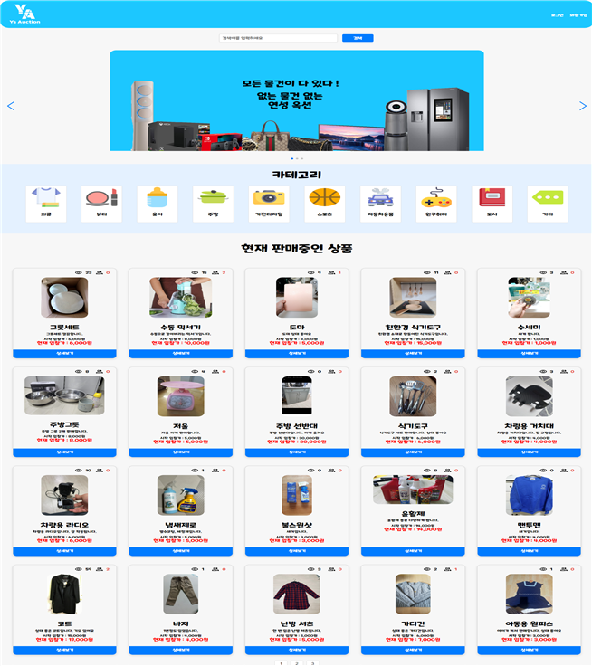

# YSAuction (연성옥션)
## 연성대학교 3학년 종합설계 프로젝트


<p align="center">
  <br>
  
  <br>
</p>


## 프로젝트 소개
- ### 개요
- 현재의 중고 거래 앱 및 사이트는 대부분 고정 가격에 기반한 판매 방식을 채택하고 있다.
그러나 이러한 방식은 중고 물품의 실제 가치를 정확히 반영하기 어렵다는 한계가 있다.
중고 물품의 가치는 다양한 요인에 의해 결정되기 때문에 판매자가 원하는 가격과 구매자가 
지불할 수 있는 적정한 가격 사이에서 타협점을 찾기 어렵다. 
이에 따라 경매 방식을 도입한 중개 웹 사이트의 필요성이 부각됨. 
경매를 통해 판매자는 물품에 더 높은 가격을 기대할 수 있고, 구매자는 실제 시장 가치에 
따라 경쟁적인 입찰을 통해 물품을 구매할 수 있다. 이러한 웹 사이트는 경매 방식의 중고 거래를 간편하게 이용하고자 하는 판매자와 구매자들에게 편리함을 제공하며, 
시장에서의 활성화와 안전한 거래를 촉진함.

- ### 목표
- 사용자들이 안전하고 편리하게 중고 물품을 경매하고 거래할 수 있는 웹 플랫폼을 개발하여, 
경매 참여자 및 관리자 간에 신뢰성 있는 서비스를 제공함.

<br>

## 기술 스택

<br>

| JavaScript | Spring Boot |  React   |  MySQL |
| :--------: | :--------: | :------: | :-----: |
|       |     |  |  |

<br>

## 구현 기능

### 기능 1
- #### 로그인 및 회원가입
- 로그인 인증 jwt 사용 서버에서 jwt 발급후 서버에 저장 이후 필요할때마다 클라이언트에서 검증요청 
### 기능 2
####
### 기능 3

### 기능 4

<br>

## 사용법
- ### Forntend

```sh
\YSCoding\src\main\frontend>
npm i
npm start
```

- ### Backend

```sh
YsCodingApplication execution
```
## 배운 점 & 아쉬운 점

